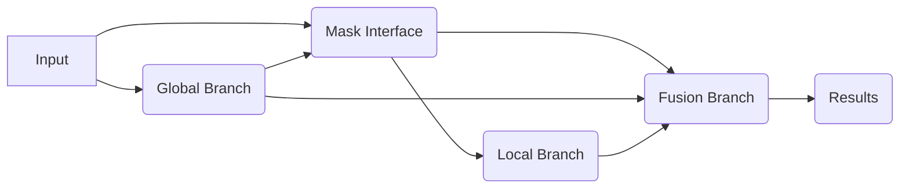

# Attention-Guided-CNN-for-NIH-Chest-XRAY-Dataset

The architecture of AG-CNN is presented in Figure 1. Basically, it has two major branches, i.e., the global and local branches, and a fusion branch. Both the global and local branches are classification networks that predict whether the pathologies are present or not in the image. Given an image, the global branch is first fine-tuned from a classification CNN using the global image. Then, we crop an attended region from the global image and train it for classification on the local branch. Finally, the last pooling layers of both the global and local branches are concatenated for fine-tuning the fusion branch. **Multi-label setup:**  We label each image with a 15-dim vector.

**Global and local branches:** The global branch informs the underlying CXR information derived from the global image as input. In the global branch, we train a variant of ResNet-50 [18] as the backbone model. It consists of five down-sampling blocks, followed by a global max pooling layer and a 15-dimensional fully connected (FC) layer for classification. At last, a sigmoid layer is added to normalize the output vector of FC layer.

On the other hand, the local branch focuses on the lesion area and is expected to alleviate the drawbacks of only using the global image. In more details, the local branch possesses the same convolutional network structure with the global branch. Note that, these two branches do not share weights since they have distinct purposes. We perform the same normalization and optimization as the global branch.

# **Training Strategy of AG-CNN:**

The model was trained in three-stage training scheme.

 - **Stage I.**  Using the global images, we fine-tune the global branch network pretrained by ImageNet.
 - **Stage II.**  Once the local image is obtained by mask inference with threshold, we feed it into the local branch for fine-tuning
   which is normalized. When we fine-tune the local branch, the weights
   in the global branch are fixed.
 - **Stage III.**  We concatenate them for a final stage of fine-tuning and normalize the probability score. Similarly, the weights of 
previous two branches are fixed when we fine-tune the weights of
   fusion branch. In each stage, we use the model with the highest AUC
   on the validation set for testing.

# **Code:**

All the libraries necessary to run this code are included in `environment.yaml` file. To make a similar environment just run the following command:

    $ conda env create -f environment.yaml

After setting up the environment, the dataset images should be place in the directory input/images.

After this run the `train.py` file using:

    $ python train.py

In the training file I first imported all the libraries, initialized all the paths & parameter values. Then I did defined the pre-processing steps using torchvision.transform as our data comprises of the images read as PIL. After pre-processing I defined a function that takes original image and the results from predictions and return the final image. The image was then transformed to heat map using binImage function. Similarly, in training we made sure to save checkpoints after epoch, so the data was not trained again if some power shortage occurs. Then the data is loaded by applying the transforms & the model is loaded from `model.py` file. For each epoch the we performed training & testing accordingly while saving the best results accordingly.

# **Optimization:**

As the chest X-Ray data relies heavily on grayscale images where the shades matter at certain points. So, to enhance that structural differences I added a little contrast to the images so that the patch area should be properly recognizable.
The results that I achieved after running for 100 epochs were as follows:

 - For Global Branch: Average AUROC = 0.842
 - For Local branch: Average AUROC = 0.810
 - For Fusion branch: Average AUROC = 0.861
 
 The weights can be found in the folder labeled `previous_model`. 
The following table will depict the results achieved by us in comparison with the other methods.

|Methods  |Average AUROC  |
|--|--|
| Wang et al. |0.738  |
|Yao et al.|0.803|
| Rajpurkar et al. |0.842  |
|Kumar et al.|0.795|
|Global Branch|0.842|
|Local Branch|0.810|
|**AG-CNN**|**0.861**|

So these results depict that while using this sequential model we can increase the average test accuracy. The global branch informs the underlying CXR information derived from the global image as input. In the global branch, we train a variant of ResNet-50 as the backbone model. It consists of five down-sampling blocks, followed by a global max pooling layer and a 15-dimensional fully connected (FC) layer for classification. On the other hand, the local branch focuses on the lesion area and is expected to alleviate the drawbacks of only using the global image. In more details, the local branch possesses the same convolutional network structure with the global branch. Note that, these two branches do not share weights since they have distinct purposes

### Graphical Presentation of Model:

